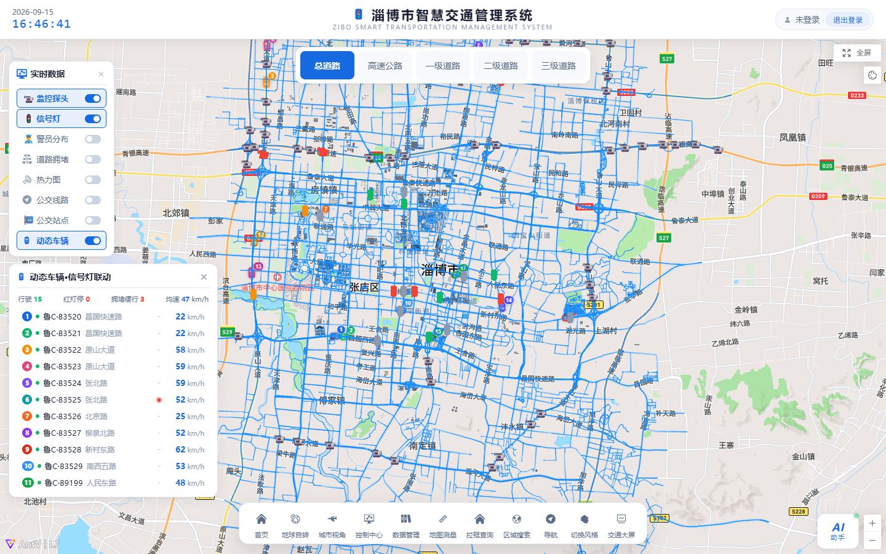
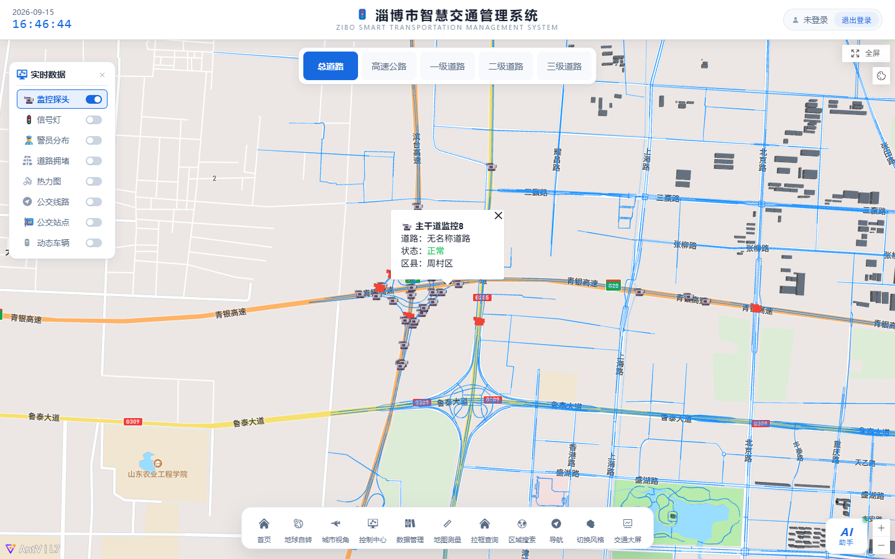
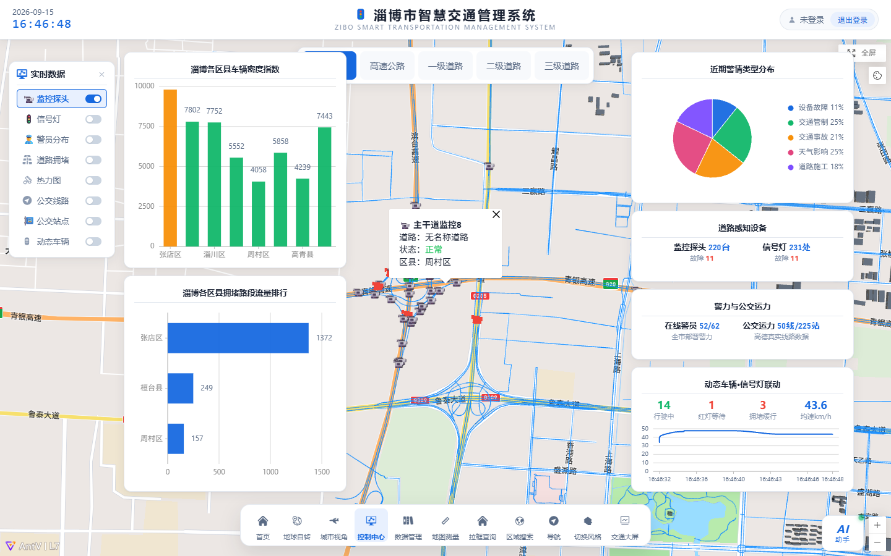
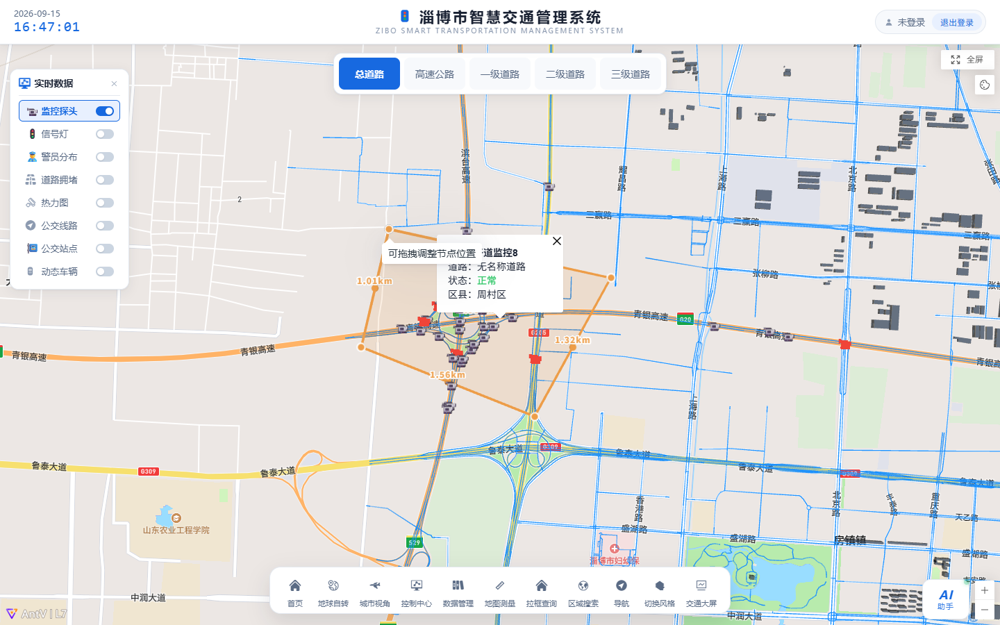
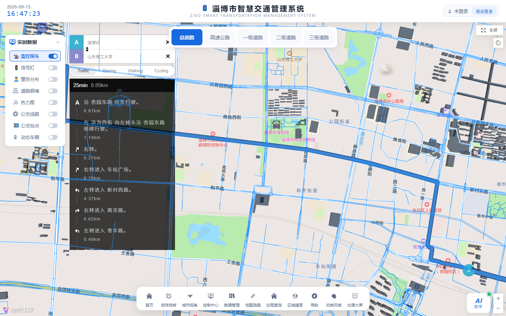
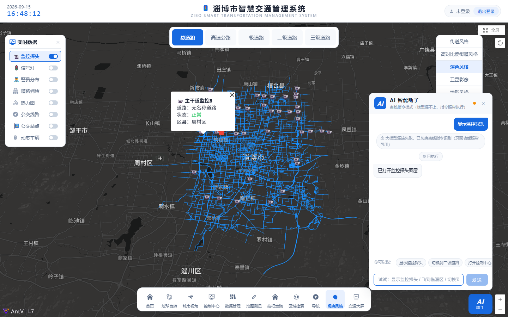
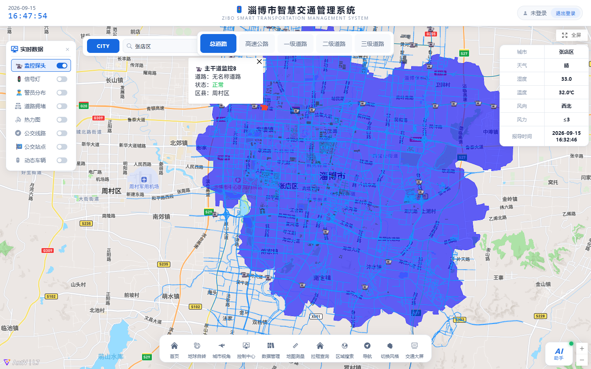
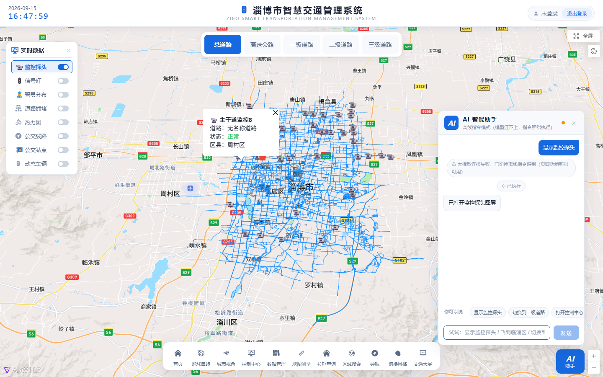

# 🚦 淄博市智慧交通管理系统 WebGIS 综合可视化平台


## 📝 项目简介

一个综合性的 **WebGIS 开发实践项目**，以「淄博市智慧交通」为核心研究区域，采用**纯前端 + 开放地图服务 API** 架构，基于 Vue3 + AntV L7 + Mapbox GL 构建实时交通监控与可视化大屏。系统沿真实 OSM 路网与区县中心布设监控探头、信号灯、警员等要素，融合高德公交、天气、行政区划等真实服务数据，实现了从宏观地球视角到微观道路监控、从静态图层叠加到 **AI 语音指令驱动**的全方位交互体验。

- **研究区域**：淄博市（中心 `118.05°E, 36.81°N` · 张店区）
- **特色亮点**：内置 AI 助手（DeepSeek 大模型 + 函数调用），文字/语音指令即可驱动导航、飞行、图层、风格等全部页面功能；无网络或 Key 失效时自动降级为离线规则引擎，常用指令依旧可用
- **界面布局**：纯净地图 + 顶部玻璃渐变标题栏 + 底部悬浮胶囊工具条（视图 → 控制 → 查询 → 风格平铺）

## ✨ 核心功能模块 (Features)

功能模块与 `src/views/` 下的组件高度解耦，主要包含以下亮点：

* 🌍 **宏观与微观视角切换**
    * **地球自转展示 (`Rotation.vue`)**：3D 地球视角自动旋转，支持无缝缩放至城市级别。
    * **城市飞行视角 (`CityView.vue`)**：多级平滑飞行，从淄博全景逐级落到街道尺度，俯瞰城市路网。
* 🚦 **智慧交通专题可视化**
    * **实时监控总览 (`Home.vue` + 底部工具条)**：监控探头 / 信号灯 / 警员 / 公交线路 / 道路拥堵 / 交通热力 / 公交站点 / 动态车辆 8 类要素开关式叠加，点击要素弹出详情气泡。
    * **动态车辆模拟（`vehicleSim.js` + `VehiclePanel.vue`）**：15 辆 🚗 沿淄博真实主干道路网持续行驶（地图 DOM 标记实时刷新），与信号灯 / 拥堵数据**联动分析**——模拟器内部按灯调度相位（绿 45s / 黄 5s / 红 45s 错峰），车辆遇前方红灯自动减速停车、绿灯恢复行驶；所在道路命中拥堵表则按路况均速限速并计入缓行统计。左下角迷你面板逐辆显示车牌 / 道路 / 速度 / 前方信号灯相位与状态，点击地图车辆气泡查看详情。
    * **控制中心 (`G2Charts.vue`)**：结合 G2Plot 图表（各区县车辆密度 / 拥堵路段流量排行 / 警情类型分布 / 动态车辆实时均速折线）+ 设施统计卡（探头 / 信号灯 / 警员 / 公交 / 车辆运行状态）。
    * **实时数据栏与道路分级栏 (`RealtimeBar.vue` / `RoadClassBar.vue`)**：左上角实时交通指数栏，顶部道路等级分层配色条。
    * **业务数据入库 + 数据管理 (`DataManage.vue` + `server/`)**：10 类业务数据入库本机 SQL Server，底部「数据管理」面板分表浏览 / 新增 / 编辑 / 删除（坐标地图点选、公交线路地图画线），保存即写库并实时重建地图图层。
* 🛠️ **专业地图分析工具**
    * **空间测量 (`MapDraw.vue`)**：多边形 / 矩形 / 圆形 / 线绘制，面积与距离实时测量。
    * **事件信息 (`EventInfo.vue`)**：交通警情事件分页列表，点击自动定位到事发位置。
* 📍 **便民 GIS 服务**
    * **路径导航 (`Navigation.vue`)**：基于 Mapbox 的驾车导航；起终点中文地名经高德精确坐标前置解析，杜绝错位路线。
    * **区域搜索 (`AreaSearch.vue`)**：高德行政区边界叠绘 + 实时天气面板（温度 / 湿度 / 风向 / 风力 / 报道时间）。
    * **底图风格切换 (`ChangeStyle.vue`)**：亮色 / 暗色 / 标准等底图风格一键切换。
* 🤖 **AI 助手 (`AIAssistant.vue`)**
    * 右下角悬浮，接入 DeepSeek 大模型（工具调用多轮对话），支持**文字与语音**输入：「导航到博山区」「显示监控探头」「去世纪路」「区域搜索淄博市」「切换到暗色风格」……
    * 指令通过反问确认后驱动真实页面跳转与地图操作，全程中文化反馈。

## 🏗️ 系统架构与技术栈

### 前端应用 (Frontend)
* **核心框架**：Vue 3（Composition API + `<script setup>`）
* **构建工具**：Vite 4
* **地图渲染底座**：AntV L7 2.15 / Mapbox GL 2.14（streets-v12 底图 + 中文汉化）
* **路径规划**：mapbox-gl-directions（高德地名坐标前置解析，绕开 Mapbox 对中文地名的错误解析）
* **图表与 UI**：G2Plot 2.4 + 纯 CSS 玻璃拟态大屏 UI（Element Plus 辅助）
* **状态与逻辑复用**：`store.js` 全局 reactive + provide/inject 响应式容器

### 数据与 AI 服务
* **高德开放平台**：地理编码 / 公交线路站点 / 实时天气 / 行政区边界
* **OSM**：真实路网、建筑几何与信号灯点位（Overpass 抓取）
* **DeepSeek**：AI 助手对话（Anthropic 协议端点，多轮工具调用 + thinking 过滤）

### 数据服务端（可选，业务数据入库后开启）
* **Express 5 + mssql（`server/index.js`，端口 3001）**：REST `/api` 增删改查，表名/列名白名单 + 全参数化查询防注入；生产模式同源托管 `dist/`
* **SQL Server 2022（本机 `ZiboSmartTraffic` 库）**：10 张业务表；建库建表脚本 `db/setup.sql`、业务数据脚本 `db/seed.sql`（SSMS 执行），账号 `zibo_app`（口令存 `server/.env`，不入版本库）
* **前端接入**：启动时 `GET /api/mapdata` 全量拉取 → `store.dbData` 响应式缓存 → 图层工厂 / 控制中心图表 / 事件检索统一消费；后端不可达时自动回退本地同源演示数据

## 📁 核心目录结构

```text
Zibo-Smart-Traffic/
├── public/                     # 静态资源与调试页
├── scripts/                    # 数据抓取与 CDP 端到端验证脚本
├── db/                         # 数据库脚本：setup.sql 建库建表 / seed.sql 业务数据（SSMS 执行）
├── server/                     # Express 数据服务端（REST /api 增删改查，读 SQL Server）
├── screenshots/                # README 系统截图（真实运行捕获）
├── src/                        # 前端源码
│   ├── assets/
│   │   ├── GIS_Data/           # 淄博路网 / 建筑 GeoJSON（OSM 真实几何）
│   │   └── images/             # 界面素材
│   ├── components/             # 页面级组件（Header / BottomTools / AIAssistant 等）
│   ├── views/                  # 九大功能视图（Rotation / CityView / G2Charts 等）
│   ├── tools/                  # GIS 工具类（initLayer / initTrafficLayers / weather 等）
│   ├── Hooks/                  # 控制中心图表数据逻辑
│   ├── router/                 # 路由配置
│   ├── store.js                # 全局 reactive 状态
│   ├── App.vue                 # 地图初始化（style 加载完成后再挂 L7 图层与 UI）
│   └── main.js
├── .gitignore
├── index.html                  # 入口（iconfont / 数字字体）
├── package.json                # 依赖管理
└── vite.config.js              # 构建配置
```

## 🗄️ 数据来源说明

数据均来自可公开获取的开源 / 开放接口，公安敏感数据不涉及：

1. **路网与建筑几何**：OSM 真实路网（`src/assets/GIS_Data/Zibo_roads.json`、`Zibo_Buildings.json`）。
2. **信号灯点位**：OSM Overpass API 抓取（高德无信号灯开放数据）。
3. **监控摄像头点位**：道路监控不公开，沿真实 OSM 路网约 1km 间隔布设（几何真实）。
4. **公交线路 / 站点**：高德开放平台 Web 服务 API。
5. **行政区边界 / 实时天气 / 地名坐标**：高德开放平台（geocode / weather / geo.datav 边界）。
6. **警员 / 警情 / 拥堵指数**：公安与交通态势数据不公开，基于真实区县中心与真实路名模拟生成；统一固定随机种子保证可复现，实时字段由 ticker 驱动波动。

## 🚀 部署与运行指南

> **常见报错自检**：若直接 `pnpm dev` / `npm run dev` 报 `'vite' 不是内部或外部命令`，
> 说明**还没安装依赖**（仓库刻意不含 node_modules），回到下面第 1 步执行 `pnpm install` 即可。
> 项目已内置预检脚本（`scripts/check-deps.mjs`），漏装依赖或漏配 Key 时会给出中文提示，不再报看不懂的错。

### 0. 前置环境要求
* Node.js 16+（建议 18/20，[nodejs.org](https://nodejs.org/) 下载）
* pnpm（推荐，`npm install -g pnpm` 安装）—— 用 npm 亦可

### 1. 克隆项目并安装依赖（首次必做！）

```bash
git clone https://github.com/jiao9328/Zibo-Smart-Traffic.git
cd Zibo-Smart-Traffic
pnpm install      # 或 npm install；安装后 node_modules 才会出现
```

### 2. 配置 API Key（Mapbox 必填，否则地图白屏）

密钥**不入版本库**（`.env` 已被 .gitignore 排除，GitHub 推送保护也会自动拦截含密钥的提交），仓库提供 `.env.example` 模板，复制后填入自己的 Key：

```bash
# Windows CMD:   copy .env.example .env
cp .env.example .env
```

再编辑 `.env`（各 Key 的申请地址见文件内注释）：

```dotenv
VITE_MAPBOX_TOKEN=pk.your_mapbox_access_token   # Mapbox（地图底图，必填）→ https://account.mapbox.com/
VITE_AMAP_KEY=your_amap_web_service_key         # 高德（区域搜索/天气/地名解析，必填）→ https://console.amap.com/
VITE_DEEPSEEK_KEY=sk-your_deepseek_api_key      # DeepSeek（AI 助手，选填）→ https://platform.deepseek.com/
VITE_DEEPSEEK_MODEL=deepseek-v4-pro             # 模型名（选填）
```

> 申请好 Key 之前也可先跑起来看 UI —— DeepSeek 缺失会自动降级为离线指令模式，
> 高德缺失仅影响区域搜索 / 天气 / 地名解析，只有 Mapbox 缺失会白屏。

### 3. 运行项目

```bash
pnpm dev          # 启动开发服务器 → http://localhost:5173
pnpm build        # 生产构建 → dist/
pnpm preview      # 本地预览构建产物

# ★ 一键启动：按需构建 + 前端 + 数据接口，单端口同源
pnpm serve        # → http://localhost:3001，同时托管 dist/ 与 /api
```

> **`pnpm serve` 做了什么**：`dist/` 不存在、或比 `src/` `index.html` `vite.config.js`
> `package.json` `.env` 旧时，先跑一次 `vite build`，再起 Express 用**同一个端口**
> 同时托管构建产物与 `/api`；都不满足则跳过构建，重复启动秒开。
>
> 与 `pnpm dev` 的分工：`dev` 是 5173 热更新、`/api` 代理到 3001，**要两个终端**；
> `serve` 是 3001 单端口跑构建产物，**一个终端**，也就是部署形态。
>
> **`server/.env` 与 SQL Server 都不是必需的**：没有也照样启动，只是数据接口连不上，
> 前端会自动回退内置演示数据（与入库数据同种子、同口径）。

浏览器打开 http://localhost:5173 ，听到「淄博智慧交通管理系统已就绪」语音播报即启动成功。

### 4. 🔐 登录系统（本地账号校验，无需数据库）

系统有登录门槛：未登录访问任何页面都会跳到登录页，输入账号密码后进入。

* **纯前端本地校验**：不连接后端、不读数据库——只跑 `npm run dev` 打开 http://localhost:5173 即停在前端登录页，登录成功原地进入系统，开箱即用。
* **账号口令**：默认 `admin` / `123456`；需要更换时在 `.env` 用 `VITE_ADMIN_USERNAME` / `VITE_ADMIN_PASSWORD` 覆盖（`.env` 不入版本库，改完重启 dev 生效）。
* 登录成功后右上角 Header 显示当前用户与「退出登录」按钮。
* 注：校验为**前端演示级**（路由拦截），`/api` 数据接口本身保持开放，请勿用于生产级鉴权场景。

**🔐 登录页** > 本地账号校验，登录成功原地进入系统（地图后台已就绪，无二次加载）。


### 5.（可选）业务数据入库 SQL Server —— 让「数据管理」面板真正读写数据库

页面默认使用内置演示数据即可跑通全部功能（与入库数据同种子、同口径）。
如需把业务数据存进本机 SQL Server 并支持页面增删改查，按下面步骤操作（约 5 分钟）：

**前置**：本机已装 SQL Server（2019/2022/Express 均可，默认实例 `localhost`）。

**① 建库建表 + 建专用账号**：用 SSMS 以 Windows 认证连上 `localhost`，打开 `db/setup.sql` 执行
（自动创建 `ZiboSmartTraffic` 库、登录 `zibo_app`（口令 `Zibo2026@Traffic`，已按最小权限做库内 db_owner）与 10 张业务表；脚本幂等可反复执行）。

**② 灌入业务数据**：SSMS 打开 `db/seed.sql` 执行（文件已 `USE ZiboSmartTraffic`，全 TRUNCATE + 批量 INSERT，幂等可重跑）。入库规模：摄像头 220 · 信号灯 231 · 警员 60 · 警情 28 · 事件 44 · 拥堵 22 · 热力点 336 · 公交线路 50 · 公交站 225 · 区县 8 = 1224 行。

> 想改数据库账号/口令：改 `db/setup.sql` 里 `CREATE LOGIN` 一行后重跑 ①，并保持 `server/.env` 中 `DB_USER` / `DB_PASSWORD` 与其一致（`.env` 不入版本库）。
> 若改了内置演示数据想重新生成灌库脚本：`pnpm db:seed`（重新输出 `db/seed.sql`）。

**③ 双终端启动**：

```bash
pnpm server    # 终端 1：数据服务端 → http://localhost:3001（健康检查 GET /api/health）
pnpm dev       # 终端 2：前端 → http://localhost:5173
```

开发模式下 `/api` 由 Vite 代理到 3001（见 `vite.config.js`；端口在 `server/.env` 的 `PORT` 改，两处需一致）；`pnpm build` 后用 `pnpm server` 单独启动即可同源托管前端 + 数据接口（部署形态）。

> 只想开一个终端看完整效果（含数据接口）就用 **`pnpm serve`**：它按需构建 dist/ 后
> 在 3001 单端口同时托管页面与 `/api`，`pnpm dev` + `pnpm server` 两个都省了。
> `pnpm server` 与 `pnpm serve` 走同一支启动脚本，区别只在 `server` 不碰前端构建。

**④ 在页面里增删改查**：点底部工具条「🗄️ 数据管理」打开面板 —— 表签切到「监控探头 / 信号灯 / 警员 / 实时警情 / 事件记录 / 拥堵路段 / 公交线路 / 公交站点」，即可分表浏览、新增、编辑、删除：
* 新增/编辑坐标可手动输入，也可点「🎯 地图点选」在地图上取点回填；
* 公交线路的走向用「✏️ 在地图画线」沿道路手绘（左键逐点、双击/右键结束），几何以 GeoJSON 入库；
* 每次保存 = 写库 → 重取该表 → 重建对应地图图层：新点位立即出现在地图上，控制中心统计与图表同步更新；
* 「热力点」表为只读展示数据，后端对只读表的新增/删除一律拒绝（403）；
* 数据库未连接 / 未建库时面板顶部给出中文原因与「重连」按钮，全站自动回退演示数据，不影响浏览。

## 📷 系统截图

**🗺️ 主界面总览** > 顶部玻璃渐变标题栏、底部悬浮工具条与左上角实时数据栏；叠加监控探头、信号灯点位与 15 辆动态车辆图层。


**🚔 监控探头图层** > 道路监控点位叠加展示，点击要素弹出详情。


**📊 控制中心图表** > G2Plot 多图 + 设施统计卡片，含动态车辆均速折线与信号灯联动统计。


**📏 空间绘制测量** > 提供多边形 / 矩形 / 圆形 / 线的绘制与测量功能。


**🧭 驾车路径导航** > 中文起终点精确解析，自动绘制路线并缩放至全程视野。


**🌍 地球旋转视角** > 3D 地球开场动画，支持无缝缩放至城市级别。


**🎨 底图风格切换** > 亮色 / 暗色 / 标准底图风格自由切换。


**⛅ 区域搜索与实时天气** > 按行政区划检索并展示实时气象信息。


**🤖 AI 语音助手** > 自然语言指令驱动全站功能，支持多轮对话。


## 🤝 贡献与许可

本项目为 WebGIS 开发实践项目，公开分享供学习与交流。欢迎在 [Issues](https://github.com/jiao9328/Zibo-Smart-Traffic/issues) 中提问、反馈或交流想法。
